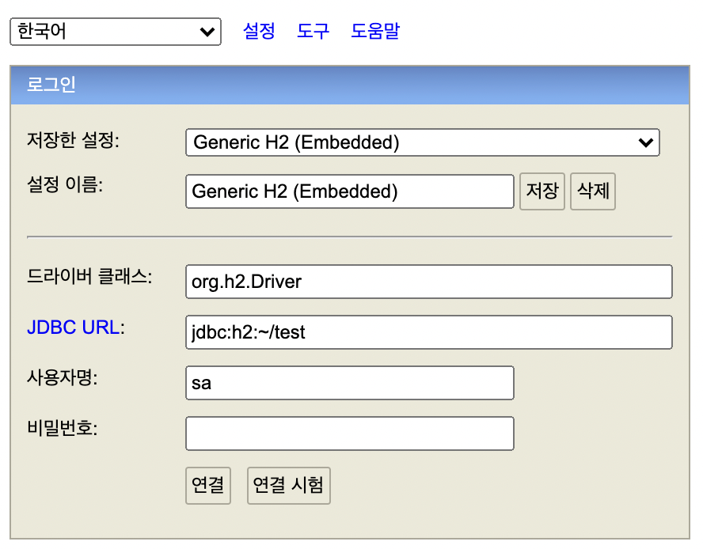

# jpabook

jpa 공부
=============

1.

jpabook: [자바 ORM 표준 JPA 프로그래밍](http://www.kyobobook.co.kr/product/detailViewKor.laf?ejkGb=KOR&mallGb=KOR&barcode=9788960777330) (
ing..)

> SpringBoot + jpa

# INSTALL

- h2 database 설치

> $ brew install h2

- h2 database admin 실행

> $ h2

드라이버 클래스 : org.h2.Driver

JDBC URL : jdbc:h2:tcp://localhost/~/test